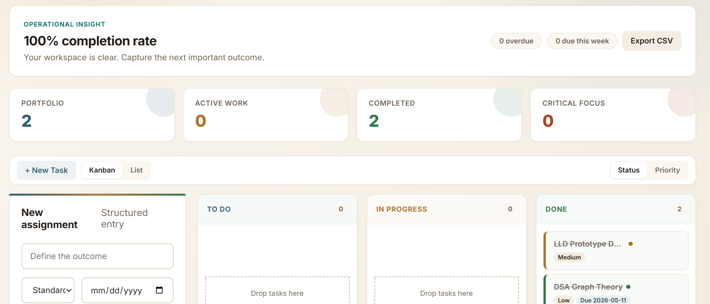
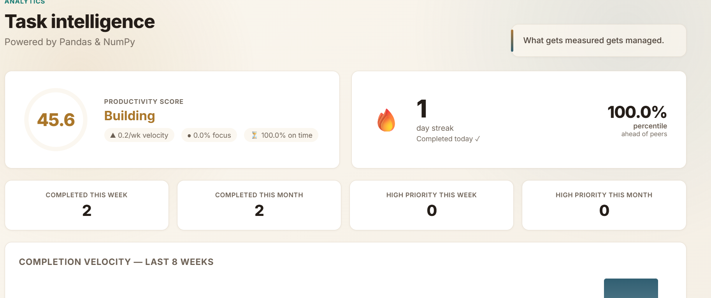
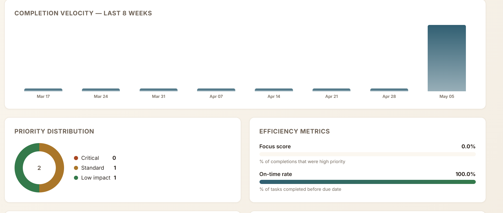
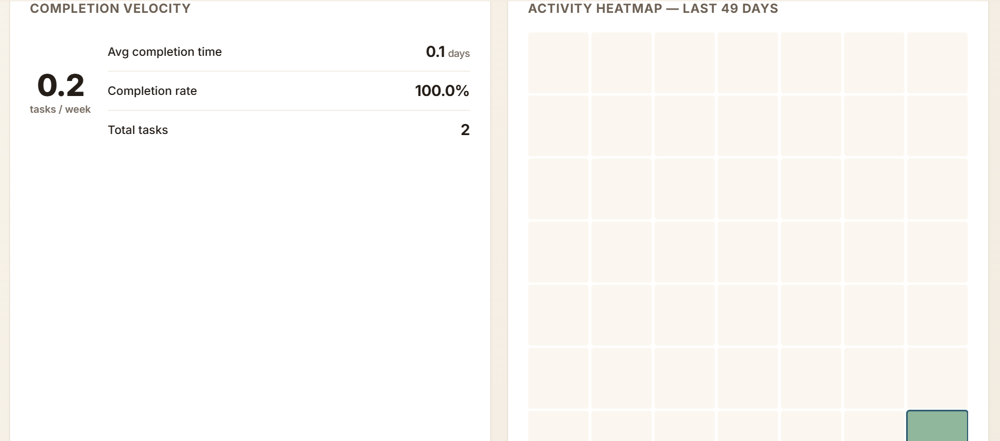

# Smart Task Manager


A full-stack task manager built with Flask, featuring real-time WebSocket updates, Pandas/NumPy analytics, kanban board, REST API, and Docker-based PostgreSQL deployment.

---

## Features

### Task Management
- Full CRUD with title, description, priority (low/medium/high), and due dates
- Kanban board view with drag-and-drop reordering (group by status or priority)
- List view with sorting by status, priority, position, and due date
- Filters by status, priority, and text search
- Date-based completion filters (`completed_after` / `completed_before`)
- CSV export of all tasks

### Real-Time Updates
- Live dashboard updates via SocketIO (no page reload needed)
- Events emitted on task create, update, delete, move, and reorder

### Analytics (Pandas & NumPy)
- Productivity score (composite: velocity × 30% + focus × 25% + on-time × 25% + completion rate × 20%)
- Weekly completion velocity — bar chart (last 8 weeks)
- Focus score — % of completions that were high priority
- On-time rate — % of tasks completed before due date
- Streak tracking — consecutive days with completions + 49-day activity heatmap
- Average completion time (days)
- Overdue / due-soon counting
- Priority distribution — interactive SVG ring chart
- User percentile ranking against all users

### REST API
- Full JSON API for all task operations
- Kanban move/reorder/reindex endpoints
- Analytics endpoint returning all computed metrics

### Authentication
- Session-based auth (register, login, logout)
- User isolation — each user sees only their own tasks

---

## Tech Stack

| Layer | Technology |
|---|---|
| Backend | Flask 3.1, Flask-SQLAlchemy, Flask-Login, Flask-SocketIO |
| Frontend | Jinja2 templates, vanilla JavaScript, Socket.IO client |
| Database | PostgreSQL 16 (production), SQLite (development/test) |
| Analytics | Pandas 3.x, NumPy |
| DevOps | Docker Compose, gunicorn + eventlet worker |
| Testing | pytest 9.x, pytest-cov |

---

## Screenshots

| | |
|---|---|
|  |  |
| **Dashboard** — task list with filters, stats grid, and kanban board | **Analytics hero** — productivity score ring, streak counter, percentile |
|  |  |
| **Analytics mid** — weekly bar chart, priority pie, focus/on-time bars | **Analytics bottom** — 49-day activity heatmap, velocity, avg completion time |
|  |  |
| **Registration page** | **Login page** |

---

## Setup

### Local Development

```bash
# 1. Clone and enter the project

# 2. Create a virtual environment
python -m venv venv
.\venv\Scripts\Activate    # Windows
source venv/bin/activate   # macOS / Linux

# 3. Install dependencies
pip install -r requirements.txt

# 4. Run (uses SQLite by default)
python app.py

# 5. Open in browser
# http://localhost:5000
```

### Docker (PostgreSQL)

```bash
docker compose up --build
```

The app will be available at `http://localhost:5000`.  
PostgreSQL is configured with user `smarttask`, database `smart_tasks`.

---

## Running Tests

```bash
$env:PYTHONPATH = "$(Get-Location)"   # Windows PowerShell
PYTHONPATH=. pytest -v                # macOS / Linux

pytest --cov     # with coverage report
```

Tests use an in-memory SQLite database and do not require Docker or PostgreSQL.

---

## REST API

All API endpoints require authentication (session cookie).

| Method | Endpoint | Description |
|---|---|---|
| `POST` | `/tasks` | Create a task |
| `GET` | `/tasks` | List tasks (`?status=`, `?priority=`, `?q=`) |
| `PUT` | `/tasks/<id>` | Update a task |
| `DELETE` | `/tasks/<id>` | Delete a task |
| `PUT` | `/tasks/<id>/move` | Move task to new status column (with optional position) |
| `PUT` | `/tasks/<id>/reorder` | Reorder task within a column |
| `POST` | `/api/tasks/reindex` | Re-index task positions for a column |
| `GET` | `/api/kanban` | Get kanban board data (`?group_by=status\|priority`) |
| `GET` | `/api/analytics` | Get analytics data (JSON) |

---

## Project Structure

```
├── app.py              # Flask application + routes
├── analytics.py        # Pandas/NumPy analytics functions
├── models.py           # SQLAlchemy models (User, Task)
├── extensions.py       # Flask extensions (db, login_manager, socketio)
├── config.py           # Configuration (DB URL, secret key)
├── requirements.txt
├── Dockerfile
├── docker-compose.yml
├── wait-for-db.py      # Docker entrypoint helper
├── schema.sql          # PostgreSQL schema dump
├── static/
│   ├── css/style.css
│   ├── js/
│   │   ├── main.js
│   │   └── socket.js   # Socket.IO client
│   └── screenshots/
├── templates/
│   ├── base.html
│   ├── dashboard.html
│   ├── analytics.html
│   ├── login.html
│   ├── register.html
│   └── edit_task.html
└── tests/
    ├── conftest.py
    ├── test_auth.py
    ├── test_api.py
    ├── test_dashboard.py
    ├── test_tasks.py
    ├── test_analytics.py
    ├── test_database.py
    └── test_websocket.py
```
